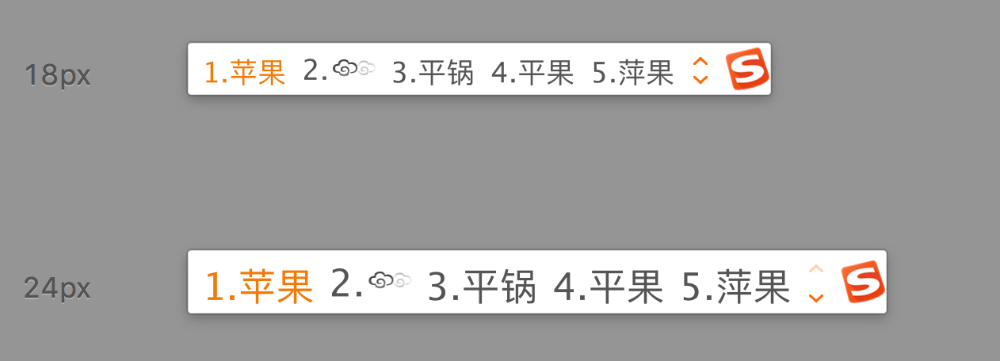
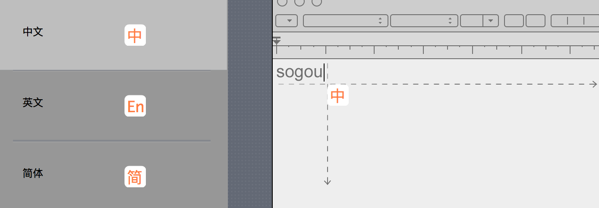
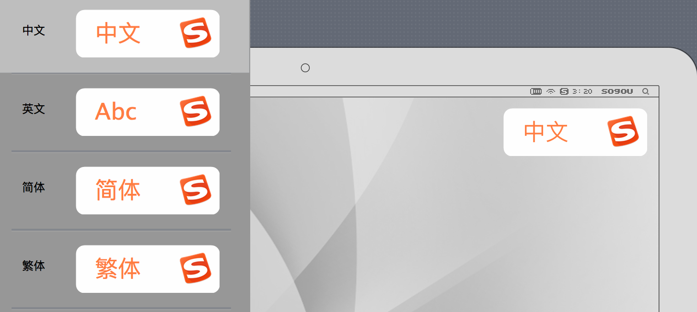
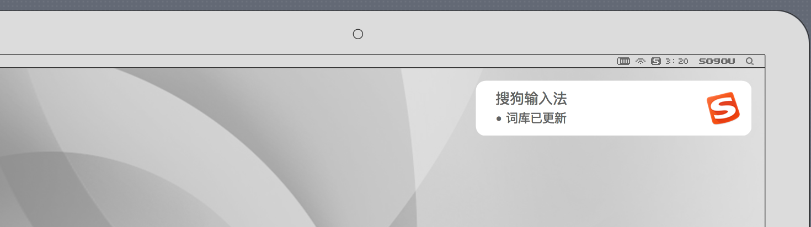

# sogou-input-skin

### 搜狗输入法Mac皮肤修改版

### 你要干嘛

> 就是感觉官方默认皮肤候选框右侧图标太大了。通知、跟随式、横幅式各种暗色，和Mac白色不搭。

### 预览图

### 使用方法

* 只适用于Mac版搜狗输入法
* 下载 [搜狗输入法Mac皮肤修改版_By_GitOPEN_1.3.mssf](搜狗输入法Mac皮肤修改版_By_GitOPEN_1.3.mssf) 单击打开就安装好了。
* 祝您好运(～￣▽￣)～